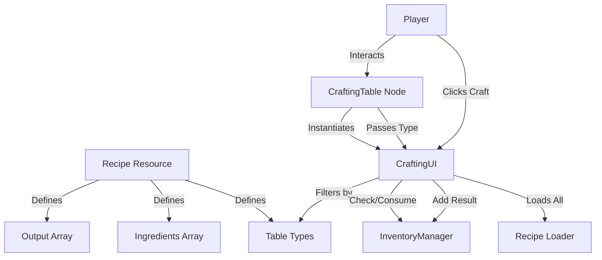

# ⚒️ Crafting System Architecture

This document outlines the architecture of the Crafting System, including the relationship between data, UI, and inventory logic.

> [!WARNING]
> **Current Status (Phase 14):** The system structure (Data/Scenes) exists, but the **Execution Logic** (Craft Button, Ingredient Consumption) is currently **Unimplemented**.

---

## 1. High-Level Data Flow

The system follows a **Data-Driven** approach using Resources (`Recipe`) to define what can be crafted.



---

## 2. Key Components

### A. Data Resources (`resources/recipe/`)
- **`Recipe.gd`**: The blueprint for a craftable item.
    - `ingredients`: Array of `RecipeIngredient`.
    - `output_items`: Array of `RecipeIngredient`.
    - `table_types`: Array of Strings (e.g., `["anvil", "workbench"]`).
- **`RecipeIngredient.gd`**: Defines an item and amount.
    - `item_data`: The `ItemData` resource.
    - `amount`: Integer count.

### B. In-Game Objects (`scenes/town/`)
- **`CraftingTable.gd`**: Physical object in the world.
    - **Properties**: `table_types` (Exported Array).
    - **Role**: Detects player interaction -> Opens UI -> Contextualizes UI (e.g., "This is an Anvil").

### C. User Interface (`scenes/ui/crafting/`)
- **`CraftingUI.gd`**: The visual interface.
    - **Current Functionality**: 
        - Loads all `.tres` files from `resources/recipe/`.
        - Filters and displays recipes matching the Table's type.
    - **Missing Functionality**:
        - `_on_recipe_selected`: Update ingredient grid.
        - `_on_craft_button_pressed`: Trigger the transaction.

### D. Integration (`InventoryManager`)
- **Current Support**: Has `add_item()`.
- **Missing Support**: Needs `has_items(data, amount)` and `consume_items(data, amount)` to support checking/removing ingredients from scattered slots.

---

## 3. Implementation Plan (ToDo)

To finalize the system, the following logic must be implemented:

### Step 1: Inventory Manager Expansion
We need helper functions to check/remove items without knowing their specific slot index.
```gdscript
# InventoryManager.gd
func has_item(item_data: ItemData, amount: int) -> bool:
    # Iterate all slots and count total quantity of item_data
    return total >= amount

func consume_item(item_data: ItemData, amount: int) -> bool:
    # Iterate slots and remove item_data until amount is satisfied
    # Return true if successful
```

### Step 2: UI Logic Connection
Connect the signals in `CraftingUI`:
1.  **Selection**: When a recipe is clicked in `RecipeList`:
    *   Clear `Ingredients` and `Results` grids.
    *   Populate `Slot` nodes with the recipe's data.
    *   Update `CraftButton` state (Disabled if `!InventoryManager.has_item(...)`).
2.  **Execution**: When `CraftButton` is pressed:
    *   Loop through ingredients -> `InventoryManager.consume_item()`.
    *   Loop through outputs -> `InventoryManager.add_item()`.

---

## 4. Usage Example

**Scenario**: Crafting a "Copper Hoe" at an "Anvil".

1.  **Data**: `copper_hoe_recipe.tres` has `table_types = ["anvil"]`.
2.  **World**: `Town.tscn` has a `CraftingTable` node with `table_types = ["anvil"]`.
3.  **Interaction**: Player clicks the Anvil.
4.  **UI**: `CraftingUI` opens. It asks: "Show me recipes for 'anvil'".
5.  **Display**: "Copper Hoe" appears in the list.
6.  **Action**: Player selects "Copper Hoe" and clicks Craft.
7.  **Result**: 5 Copper Bars removed, 1 Copper Hoe added.
