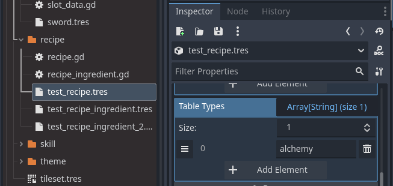

# 크래프팅 시스템 : 테이블 종류별 레시피 분류

---

## 2. 크래프팅 테이블 종류 관리 및 레시피 분류



레시피가 어떤 크래프팅 테이블에서 제작 가능한지 Table Types


크래프팅 테이블이 어떤 종류의 Table Types인지

위의 예시와 같이 레시피와 크래프팅 테이블 모두 Table Types들 중 하나라도 매칭된다면(Table Types가 복수인 경우도 있으므로)


alchemy 레시피(들)이 alchemy 크래프팅 테이블에 뜨는 모습

위와 같이 크래프팅 테이블별로 제작 가능한 레시피들이 달리 표기된다.

### 목표

- 다양한 종류의 크래프팅 테이블(예: 모루, 연금 테이블, 용광로 등)에 따라
각기 다른 레시피가 UI에 표시되도록 시스템을 설계한다.

---

### 구현 방식

### 1. **Recipe 리소스 구조**

```python
extends Resource
class_name Recipe

@export var name: String
@export var ingredients: Array[RecipeIngredient] = []
@export var output_items: Array[RecipeIngredient] = []
@export var table_types: Array[String] = ["alchemy"] # 단일 -> 배열로 변경, 예: ["anvil", "alchemy", "furnace"]
```

- 각 레시피 리소스(`Recipe`)에`table_types: Array[String]` 필드를 추가하여
이 레시피가 어떤 테이블에서 사용 가능한지 배열로 지정한다.
    - 예시: `["anvil", "alchemy", "furnace"]`

### 2. **CraftingTable 구조**

```python
extends Area2D

@export var crafting_ui_scene: PackedScene
@export var table_types: Array[String] = ["alchemy"] # 배열로 변경
```

- 각 크래프팅 테이블(`CraftingTable`)에도`table_types: Array[String]`를 지정한다.
    - 예시: 연금 테이블은 `["alchemy"]`,
    특수 테이블은 `["anvil", "furnace"]` 등

### 3. **CraftingUI 동작**

```python
extends PanelContainer

@onready var recipe_list = %RecipeList

var all_recipes: Array[Recipe] = []
var table_types: Array[String] = []
```

- 크래프팅 UI를 열 때,
해당 테이블의 `table_types` 배열을 UI에 전달한다.
- UI는 모든 레시피 중**레시피의 `table_types`에 테이블의 타입이 하나라도 포함되어 있으면**
해당 레시피를 리스트에 표시한다.

---

### 테이블 타입을 배열로 전달하는 이유

1. **여러 테이블에서 동일 레시피 사용 가능**
    - 하나의 레시피가 여러 종류의 테이블에서 제작 가능하도록 할 수 있다.
2. **레시피 데이터의 중복 방지**
    - 같은 레시피를 여러 테이블에서 사용해도 리소스 파일을 하나만 관리하면 된다.
3. **유지보수 및 확장성 향상**
    - 새로운 테이블이 추가될 때, 배열에 타입만 추가하면 모든 테이블에 반영된다.
4. **게임 밸런싱/콘텐츠 확장에 유리**
    - 특정 레시피를 여러 제작 방식에서 동시에 제공할 때 유연하게 대응할 수 있다.

---

### 코드 작성 시 주의점

- **add_child() 호출 전에 반드시 table_types를 세팅해야 함!**
    - add_child()가 호출되면 CraftingUI의 _ready()가 즉시 실행되고,
    _ready()에서 table_types를 사용해 레시피를 필터링하기 때문임.
- 이를 명확히 주석으로 남겨 실수 방지

---

### 예시 코드 (중요 부분 발췌)

```python
# crafting_table.gd
func show_crafting_ui():
    if crafting_ui_scene:
        var crafting_ui = crafting_ui_scene.instantiate()
        # 주의: 반드시 add_child() 호출 전에 table_types를 세팅해야 함!
        crafting_ui.table_types = table_types

        var root = get_tree().get_root()
        var town_ui = root.get_node("Town/TownUI")
        if town_ui:
            town_ui.add_child(crafting_ui)
        else:
            root.add_child(crafting_ui)
        get_tree().paused = true

```

---

**이 구조를 통해 크래프팅 테이블별로 유연하고 확장성 있게 레시피를 관리할 수 있다.**